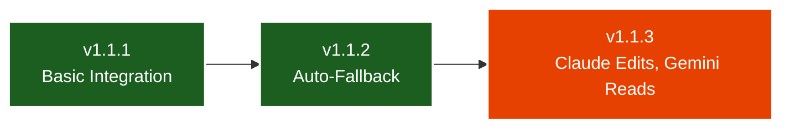
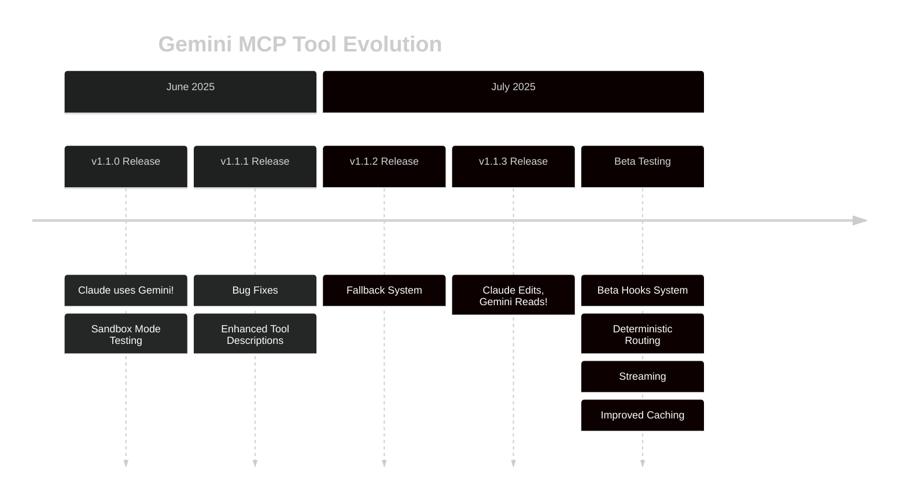

# Roadmap

## Evolution

<DiagramModal>

```mermaid
---
config:
  flowchart:
    htmlLabels: false
    curve: cardinal
---
flowchart LR
    A["v1.1.1
    Basic Integration"] --> B["v1.1.2
    Auto-Fallback"]
    B --> C["v1.1.3
    Claude Edits, Gemini Reads"]
    
    classDef releasedNode fill:#1b5e20,stroke:#fff,color:#fff,stroke-width:2px
    classDef currentNode fill:#e64100,stroke:#fff,color:#fff,stroke-width:2px
    
    class A,B releasedNode
    class C currentNode
```
</DiagramModal>

## Timeline

<DiagramModal>

```mermaid
---
config:
  timeline:
    htmlLabels: false
  theme: dark
---
timeline
    title Gemini MCP Tool Evolution
    
    section June 2025
        v1.1.0 Release : Claude uses Gemini!
                       : Sandbox Mode Testing
        
        v1.1.1 Release : Bug Fixes
                       : Enhanced Tool Descriptions
                       
    section July 2025
        v1.1.2 Release : Fallback System
                       
        v1.1.3 Release : Claude Edits, Gemini Reads!
                       
        Beta Testing   : Beta Hooks System
                       : Deterministic Routing
                       : Streaming
                       : Improved Caching
```
</DiagramModal>